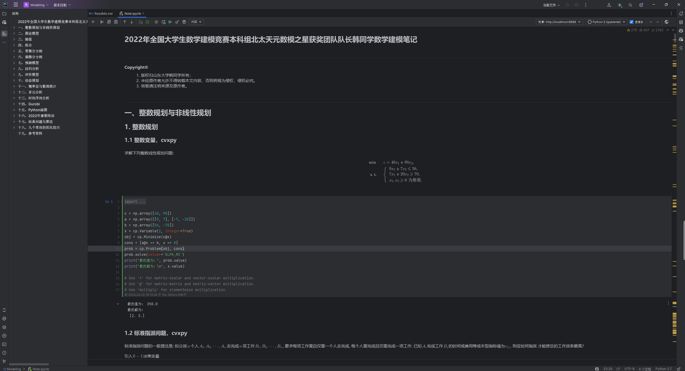
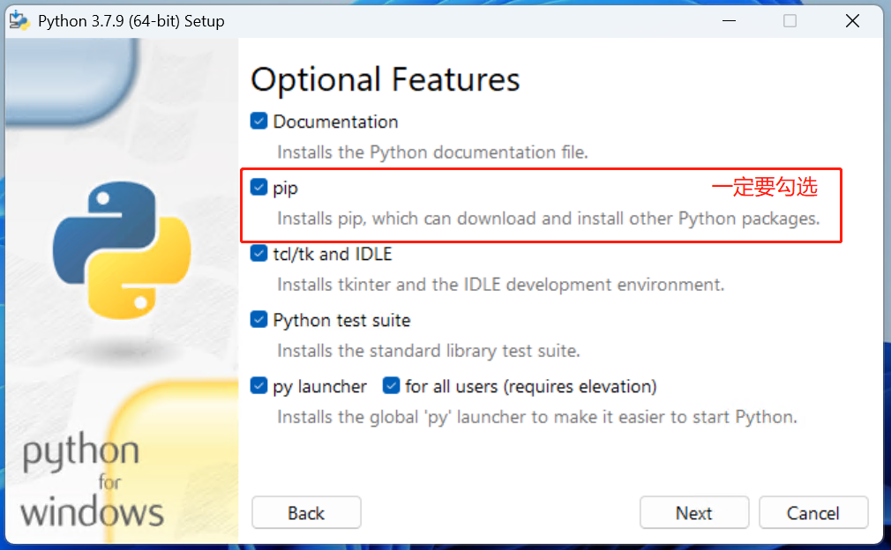
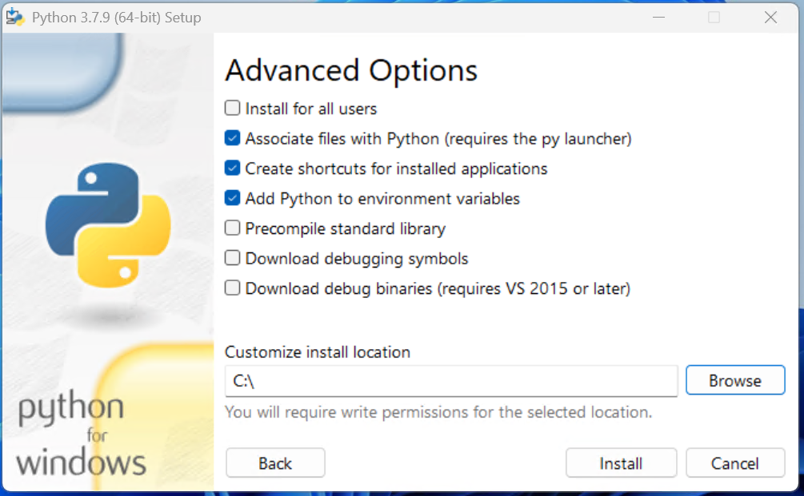
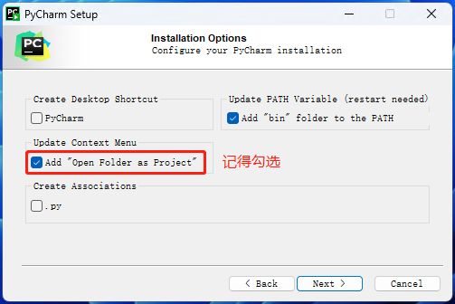
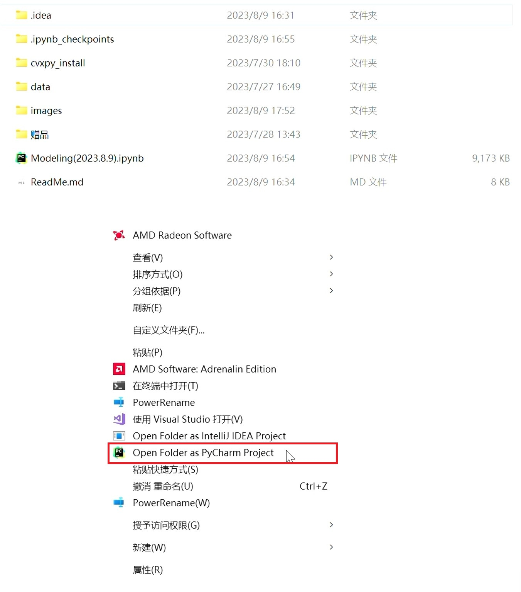
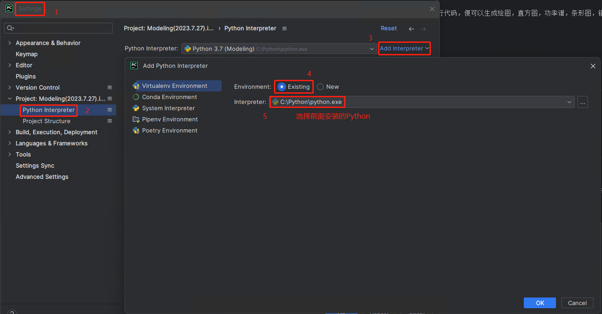
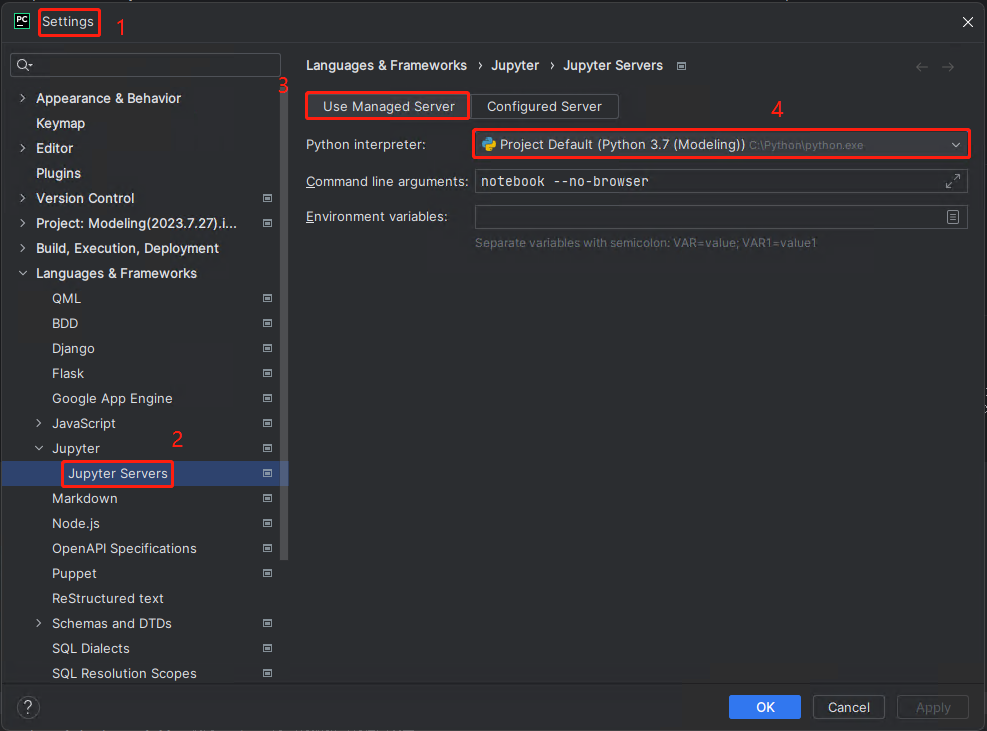
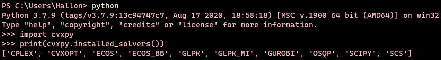

# 申明转载。原作者账户已注销。

本人，笔记作者，山东大学数学与应用数学专业，获得2022年**全国大学生数学建模竞赛**本科组特等奖**北太天元数模之星奖**、北太天元校园大使奖。从2022年初开始整理这份笔记，边学新知识边整理，最后一次更新于2023年8月15日。写本文的目的是分享之前学习数学建模时整理的笔记，供需要的同学查看、使用。

下面就笔记相关事项进行较为详细的介绍。

# 一、Copyright©

1.  版权归作者所有。  

2.  未经原作者允许不得转载本文内容，否则将视为侵权，侵权必究。  
3.  转载请注明来源及原作者。

# 二、该笔记的特色

1. 笔记内容全文手敲。理论部分（文字**Markdown**书写，公式**LaTeX**排版）和代码部分（**Python**）可以稍加修改**用于建模比赛中，节省时间**。

2. 笔记查看编辑基于Jupyterlab。**可读性强、可编辑性强、集模型理论与代码一体，免去边看理论边找代码**的烦恼。

3.  笔记模型代码覆盖面广。包含**13个常见模型，256个Python代码**。

4.  笔记第十五章**Python画图。**包含了各种常见图的Python代码，超详细，超齐全~ 
5.  笔记第十六章2022年暑期培训。这是去年山东大学组织的一次暑期培训，整理了**省组委会、全国组委会**老师开展讲座的内容，非常权威，其他地方绝对见不到~（包含**国赛评阅标准**）
6. 赠品多多，许多是**独家、首发**（毕竟是获奖者本人~）
   - 3.1基于局部最优模型的无人机位置调整策略与仿真定位_比赛提交原版.pdf_
   - 3.2基于局部最优模型的无人机位置调整策略与仿真定位-韩**发表.pdf
   - 3.3数学建模大讲堂报告.pdf
   - 3.4 python_matplotlib：几份matlibplot库的小册子，全部pdf超清版，方便快速查找Python画图不同格式对应的代码。
   - 3.5 PythonDataScienceHandbook：电子书与Jupyter代码笔记。


# 三、安装与使用

**熟悉Jupyter的同学请忽略本节内容。**

笔记是在**Jupyter**环境下使用Markdown与Python整理。推荐在**Pycharm Professional 或 VS Code**中打开使用该笔记，响应快。Jupyter的Web端每次打开，由于笔记规模较大，Markdown语法需要一段时间（10min左右）才能全部完成编译，Pycharm由于本地有缓存，不需要每次打开都编译。

**需要注意的是：PyCharm官网有两个版本，Community Edition与Professional版，前者仅支持Jupyter预览，后者PyCharm Professional才可以编辑笔记。所以，请大家使用Pycharm Professional 或 VS Code打开该笔记。**

使用Pycharm打开编辑该笔记仅需要如下四步：

1. 安装Python

2. 安装Jupyter

3. 安装Pycharm Professional（如果喜欢Jupyter的Web端打开使用笔记，可忽视第3、4步骤）

4. 配置Pycharm。也就是说让编译器Python与编辑器Pycharm关联起来。

5. 打开使用

后面会详细介绍每一步如何进行。

如下是 Note.ipynb 在 Pycharm Professional 中的效果图。




## 1. Python安装

建议安装**Python3.7**版本，因为cvxpy库仅支持3.7版本。Python3.7.9安装包（Windows 64位，3.7版本可安装的最新版为Python3.7.9）我放在了cvxpy_install文件夹，打开安装，安装步骤如下，注意几个勾选：






## 2. Jupyter安装与Web端打开

Jupyter Notebook是一个Web应用程序，允许您创建和共享包含**实时代码，方程，可视化和说明文本**的文档。个人认为，使用Jupyter整理数学建模笔记是非常方便的，用Markdown写数模知识，用Python写代码。下面介绍Jupyter的安装：

- Jupyter安装---只需在命令提示符输入下面命令：
```powershell
pip install jupyter
```
- Jupyterlab Web端打开---只需在命令提示符输入下面命令：

```powershell
jupyter-lab
```

- Jupyter Notebook Web端打开---只需在命令提示符输入下面命令：

```powershell
jupyter notebook
```

## 3. Pycharm安装

Pycharm是JetBrains公司为专业开发者提供的PythonIDE，简单来说就是个十分专业的Python编辑器。上文提到过，建议用**PyCharm Professional**打开使用笔记。

Pycharm Professional官网下载安装即可。通过学生邮箱注册账号可以免费使用。安装时记得勾选 Add"Open Folder as Project"。



安装完毕后，即可通过如下图所示的方式打开使用笔记。



## 4. 配置Pycharm

首先关联编译器Python与编辑器Pycharm，如下图操作（完成这一步后，即可编译.py文件）：



其次，配置Jupyter。一般关联完编译器Python与编辑器Pycharm后，下图所示的Jupyter配置是默认的，如果没有默认，请如下图操作：



## 5.打开使用

完成以上步骤，笔记就可以在Pycharm中丝滑使用了。笔记中的代码涉及众多Python第三方库，缺啥安装啥。安装步骤见下面一节"常见库的安装"。

# 四、 常见库的安装

本数学建模笔记所有代码均可在**Python3.7**下运行，版本过新或过旧可能导致代码运行出错（该情况很少发生）。如若代码报错，**请首先检查是否导入的库没有安装**，比如，第一章的Sudoku求解与第十四章的Gurobi，均用到了gurobipy库。

## 1. Gurobi安装

Gurobi是一个用于求解数值规划问题的求解器。它能够用于求解线性规划、二次规划、二次约束规划、混合整数线性规划、解混合整数二次规划以及混合整数二次约束规划的问题。与其他的求解器相比，Gurobi所能求解的基准问题更多，而且求解的速度更快。使用学生邮箱可免费安装使用，安装使用可参考：https://zhuanlan.zhihu.com/p/212191049. 同一问题使用cvxpy库一般也可以解决。

## 2. cvxpy安装

cvxpy与MATLAB中cvx的工具库类似，用于求解凸优化问题。cvx与cvxpy都是由CIT的Stephen Boyd教授课题组开发的。cvx是用于MATLAB的库，cvxpy是用于Python的库。在解凸优化问题，尤其是线性规划问题中，cvxpy库是十分常用的。但是，cvxpy库的安装是一个很麻烦的过程，它不支持在线安装。网上有很多关于cvxpy库安装的各种报错信息的处理方式。

cvxpy库所依赖的工具库有很多, 有NumPy+mkl, SciPy, cvxopt, scs, ecos, fastcache和osqp等等。Python官方工具库下载地址[PyPI · The Python Package Index](https://pypi.org/)，下载安装的时候一定要注意工具库版本要与python版本一致。

**需要注意的是：**

- cvxpy只支持**Python 3.7**版本，高版本的Python无法运行cvxpy库。

- 安装的工具库版本必须与Python版本和系统相对应，其中源文件名中的cp37表示 Python 3.7, amd64表示64位, win32表示32位。

- NumPy库的安装版本有很多，一定要选择NumPy+mkl库。

不过这些大家不用担心，按照我下面写的三步就能安装成功，以系统为Windows 64位+Python 3.7的计算机为例。

**Step1：**Python版本改为Python3.7.9（目前官网能下载的3.7版本最高应该是3.7.9，安装包我放在了文件夹"cvxpy_install"里面了）

**Step2：**在命令提示符输入下面命令安装cvxpy库。此外还有两个cvxpy依赖的工具库需要手动安装，见Step3.

```powershell
pip install cvxpy
```

**Step3：**将文件夹"cvxpy_install"里面的"cvxopt-1.3.0-cp37-cp37m-win_amd64.whl"与"numpy-1.21.6+mkl-cp37-cp37m-win_amd64.whl"复制到自己电脑python\Lib\site-packages目录下，在命令提示符（注意命令提示符路径需要与两个安装包所在文件夹路径一致，否则提示文件不存在。可通过命令"cd+绝对路径"调换命令提示符路径，例如"cd D:python\Lib\site-packages"）输入下面命令安装即可。

```powershell
pip install cvxopt-1.3.0-cp37-cp37m-win_amd64.whl
pip install numpy-1.21.6+mkl-cp37-cp37m-win_amd64.whl
```

**Step4：**在Python环境下输入下面代码检查是否安装成功。

```powershell
import cvxpy
print(cvxpy.installed_solvers())
```

如果输出显示有'GLPK_MI'就算安装成功了。下面是我电脑输出的结果。



## 3. 其他库安装

除gurobipy、cvxpy，其余库的安装，在命令提示符输入"pip install+库名"即可安装。例如安装matplotlib库，只需在命令提示符输入下面命令：

```powershell
pip install matplotlib
```

# 五、笔记参考资料

1. 司守奎, 孙玺菁. Python数学实验与建模[M]. 北京: 科学出版社. 2020.
2. 姜启源, 谢金星, 叶俊. 数学模型[M]. 第五版. 北京: 高等教育出版社. 2018.
3. J. VanderPlas, Python Data Science Handbook, 1st ed., O'Reilly Media, 2016.（电子版见赠品）

# 六、赠品

1. CUMCM2022B无人机遂行编队飞行中的纯方位无源定位，本科组北太天元数模之星奖获得团队论文pdf**原版，无水印**。
2. CUMCM2022B无人机遂行编队飞行中的纯方位无源定位，本科组北太天元数模之星奖获得团队发表至数学建模及其应用论文pdf版。
3. 2023年高等教育出版社开展的数学建模大讲堂本科组北太天元数模之星获得团队报告pdf版。
4. matlibplot库使用小册子。
5. Python Data Science Handbook电子版与jupyter笔记。
6. 图算法 山东大学 李龙龙。 
